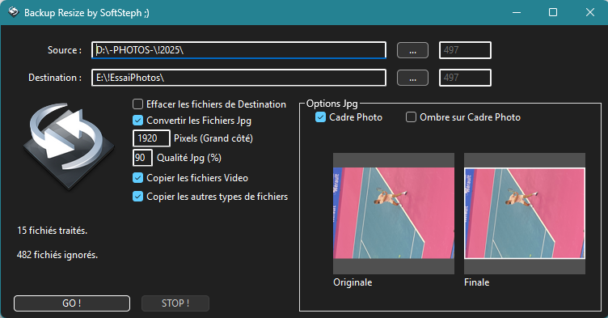

# Xojo-BackupResize
Logiciel permettant de sauvegarder des fichiers en convertissant les fichiers JPG

Fonctionnalités :
  - Fonctionne sous MacOs et Pc Windows
  - Réglage de la résolution
  - Réglage de la qualité Jpg
  - Ajout possible d'un cadre photo
  - Ajout possible d'une ombre sur cadre photo
  - Possibilité d'effacer le répertoire de destination, ou d'ignorer les photos déjà converties
  
  ToDo List:
 - Corriger le bug sous Windows de mauvaise rotation des images

# Mac-Os v0.5

# Windows v0.8 (last)

Historique des Versions :

v0.8 du 01/03/2025
Ajout de la possibilité de copier tous les types de fichiers

v0.7 du 01/03/2025
Ajout de l'option d'Antialiasing pour une meilleur qualité des photos

v0.06 du 11/09/2023
Api 2.0

v0.5 du 19/08/2022
Correction d'un Bug lors de l'importation de repertoires avec beaucoup de Photos

v0.4 du 23/10/2019
Réglage de la Résolution
Réglage de la Qualité de Compression Jpg
Intégration aux Préférences
Corrections de bugs divers sur l'interface

v0.3 du 23/10/2019
Bouton STOP pour interruption de la convertion ou de la copie des fichiers

v.0.2 du 22/10/2019
Système de Sauvegarde des Préférences au format JSON
(Actuellement sauvegardé dans SpecialFolder/ApplicationData)

v.0.1 du 21/10/2019
L'image dans les canvas est désormais sur fond sombre

Si vous aimez mes programmes, <a href="https://www.paypal.com/donate/?hosted_button_id=GY5LTDDPZ2HZG"> vous pouvez faire un don PayPal ;)</a>
